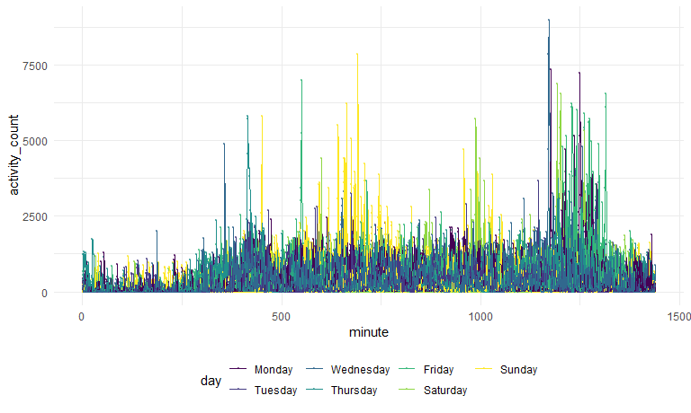

p8105\_hw3\_xl2834
================
Xiaoyu Li
10/04/2020

## Problem 1

``` r
data("instacart")
```

This dataset contains 1384617 rows and 15 columns.

Observations are the level of items in orders by user. There are user /
order variables – user ID, order ID, order day, and order hour. There
are also item variables – name, aisle, department, and some numeric
codes.

#### How many aisles are there, and which aisles are the most items ordered from?

``` r
instacart %>% 
  count(aisle) %>% 
  arrange(desc(n))
```

    ## # A tibble: 134 x 2
    ##    aisle                              n
    ##    <chr>                          <int>
    ##  1 fresh vegetables              150609
    ##  2 fresh fruits                  150473
    ##  3 packaged vegetables fruits     78493
    ##  4 yogurt                         55240
    ##  5 packaged cheese                41699
    ##  6 water seltzer sparkling water  36617
    ##  7 milk                           32644
    ##  8 chips pretzels                 31269
    ##  9 soy lactosefree                26240
    ## 10 bread                          23635
    ## # ... with 124 more rows

#### Make a plot.

Make a plot that shows the number of items ordered in each aisle,
limiting this to aisles with more than 10000 items ordered. Arrange
aisles sensibly, and organize your plot so others can read it.

``` r
instacart %>% 
  count(aisle) %>% 
  filter(n > 10000) %>% 
  mutate(aisle = factor(aisle),
         aisle = fct_reorder(aisle, n)) %>% 
  ggplot(aes(x = aisle, y = n)) + 
  geom_point() +
  theme(axis.text = element_text(angle = 90, vjust = 0.5, hjust = 1))
```


#### Make a table

Make a table showing the three most popular items in each of the aisles
“baking ingredients”, “dog food care”, and “packaged vegetables
fruits”. Include the number of times each item is ordered in your
table.

``` r
instacart %>% 
  filter(aisle %in% c("baking ingredients", "dog food care", "packaged vegetables fruits")) %>% 
  group_by(aisle) %>% 
  count(product_name) %>% 
  mutate(rank = min_rank(desc(n))) %>% 
  filter(rank <= 3) %>% 
  arrange(aisle, rank) %>% 
  knitr::kable()
```

| aisle                      | product\_name                                 |    n | rank |
| :------------------------- | :-------------------------------------------- | ---: | ---: |
| baking ingredients         | Light Brown Sugar                             |  499 |    1 |
| baking ingredients         | Pure Baking Soda                              |  387 |    2 |
| baking ingredients         | Cane Sugar                                    |  336 |    3 |
| dog food care              | Snack Sticks Chicken & Rice Recipe Dog Treats |   30 |    1 |
| dog food care              | Organix Chicken & Brown Rice Recipe           |   28 |    2 |
| dog food care              | Small Dog Biscuits                            |   26 |    3 |
| packaged vegetables fruits | Organic Baby Spinach                          | 9784 |    1 |
| packaged vegetables fruits | Organic Raspberries                           | 5546 |    2 |
| packaged vegetables fruits | Organic Blueberries                           | 4966 |    3 |

#### Apples vs ice cream.

``` r
instacart %>% 
    filter(product_name %in% c("Pink Lady Apples", "Coffee Ice Cream")) %>% 
    group_by(product_name, order_dow) %>% 
    summarize(mean_hour = mean(order_hour_of_day)) %>% 
    pivot_wider(
        names_from = order_dow,
        values_from = mean_hour
    )
```

    ## `summarise()` regrouping output by 'product_name' (override with `.groups` argument)

    ## # A tibble: 2 x 8
    ## # Groups:   product_name [2]
    ##   product_name       `0`   `1`   `2`   `3`   `4`   `5`   `6`
    ##   <chr>            <dbl> <dbl> <dbl> <dbl> <dbl> <dbl> <dbl>
    ## 1 Coffee Ice Cream  13.8  14.3  15.4  15.3  15.2  12.3  13.8
    ## 2 Pink Lady Apples  13.4  11.4  11.7  14.2  11.6  12.8  11.9

## Problem 2

#### Tidy the dataset

``` r
accel_df = read_csv(
  "./data/accel_data.csv") %>%
  janitor::clean_names() %>% 
  pivot_longer(
    activity_1:activity_1440,
    names_to = "minute",
    names_prefix = "activity_",
    values_to = "activity_count"
    ) %>% 
  mutate(activity_count = round(activity_count, digits = 0)) %>% 
  mutate(minute = as.integer(minute),
         activity_count = as.integer(activity_count),
         ) %>% 
  mutate(day_type = case_when(
    day %in% c("Saturday", "Sunday") ~ "Weekend",
    day %in% c("Monday", "Tuesday", "Wednesday", "Thursday", "Friday") ~ "Weekday")) %>% 
  mutate(day = ordered(day, levels = c("Monday", "Tuesday", "Wednesday", "Thursday", 
                                      "Friday","Saturday", "Sunday"))) %>% 
  arrange(week, day)
```

    ## Parsed with column specification:
    ## cols(
    ##   .default = col_double(),
    ##   day = col_character()
    ## )

    ## See spec(...) for full column specifications.

The dataset contains 50400 observations and 6 variables. There are
variables for time – week, day id, day of the week, a variable
indicating weekday/weekend, and the minute of that day. There is a
variable showing activity of the person in a specific minute.

#### Total activity for each day

``` r
accel_df %>% 
  group_by(week, day) %>% 
  summarize(
    daily_activity = sum(activity_count)
  ) %>% 
  pivot_wider(
    names_from = day,
    values_from = daily_activity
  ) %>% 
  knitr::kable()
```

    ## `summarise()` regrouping output by 'week' (override with `.groups` argument)

| week | Monday | Tuesday | Wednesday | Thursday | Friday | Saturday | Sunday |
| ---: | -----: | ------: | --------: | -------: | -----: | -------: | -----: |
|    1 |  78830 |  307103 |    340113 |   355948 | 480534 |   376254 | 631105 |
|    2 | 295431 |  423245 |    440962 |   474048 | 568839 |   607175 | 422018 |
|    3 | 685910 |  381507 |    468869 |   371230 | 467420 |   382928 | 467052 |
|    4 | 409450 |  319568 |    434460 |   340291 | 154049 |     1440 | 260617 |
|    5 | 389080 |  367824 |    445366 |   549658 | 620860 |     1440 | 138421 |

It seems that the person’s activity count is steady during weekdays
throughout the 5 weeks, except for Monday in Week 1 when he was less
active. The activity on weekends fluctuated throughout the 5 weeks. He
was more active than usual on the Saturday of Week 1 and 2, and less
active on the Saturday of Week 4 and Week 5.

#### Make a plot showing daily activities

``` r
accel_df %>% 
  group_by(day_id) %>% 
  ggplot(aes(x = minute, y = activity_count, color = day, group = day_id)) +
  geom_point(alpha = 0.5, size = 0.5) +
  geom_line()
```



From the graph, we can see that the person is more active at around
10-12am, while less active at other time periods on Sundays compared to
other days in the week.The person is active at Friday nights and
Saturday nights.

## Problem 3

``` r
data("ny_noaa")
```

The dataset contains weather information collected by New York state
weather stations. It has 2595176 rows and 7 columns. The variables
include weather station id, observation date, precipitation, snowfall,
snow depth and maximum and minimum of temperature. The observation date
in record spans from 1981-01-01 to 2010-12-31. There maximum
temperatures range from -1 to 99 tenths of degrees C. There are a lot of
missing values, especially for the maximum and minimum temperatures.
However, this will not be a big issue because there is a large number of
observations available, and we could ignore those missing values when
doing analysis.

#### Do some data cleaning

``` r
weather_df = 
  mutate(ny_noaa,
         tmin = as.numeric(tmin),
         tmax = as.numeric(tmax),
         prcp = as.numeric(prcp)) %>% 
  mutate(tmin = tmin / 10,
         tmax = tmax / 10,
         prcp = prcp / 10) %>% 
  separate(date, into = c("year", "month", "day"), sep = "-" ) 


weather_df %>% 
  count(snow) %>%
  mutate(rank = min_rank(n))
```

    ## # A tibble: 282 x 3
    ##     snow       n  rank
    ##    <int>   <int> <int>
    ##  1   -13       1     1
    ##  2     0 2008508   282
    ##  3     3    8790   273
    ##  4     5    9748   275
    ##  5     8    9962   276
    ##  6    10    5106   271
    ##  7    13   23095   279
    ##  8    15    3672   267
    ##  9    18    3226   266
    ## 10    20    4797   270
    ## # ... with 272 more rows

“0” is the most observed value. Because in most days in a year in New
York, there is no snow fall.

#### Make a two-panel plot

``` r
weather_df %>% 
  filter(month %in% c("01", "07")) %>% 
  group_by(id, year, month) %>%
  summarise(mean_tmax = mean(tmax, na.rm = TRUE)) %>% 
  ggplot(aes(x = year, y = mean_tmax, group = id, color = id)) +
  geom_point(alpha = 0.5) + 
  geom_path() +
  facet_grid(. ~ month) +
  theme(axis.text = element_text(angle = 90, vjust = 0.5, hjust = 1),
        legend.position = "none")
```

    ## `summarise()` regrouping output by 'id', 'year' (override with `.groups` argument)

    ## Warning: Removed 5970 rows containing missing values (geom_point).

    ## Warning: Removed 5931 row(s) containing missing values (geom_path).


The max temperatures fluctuated in both January (from around -12 to 10
degrees C) and July (from around 20 to 32 degrees C) across the years,
and the fluctuation is larger in January. In 1994 and 2004, the tmax in
January is lower than usual. The mean maximum temperature in January has
a slight increase trend over the years, which may indicate global
warming. There are outliers in January in 1982, 2004 and 2005, and in
July in 1984 and 2004.

#### Another two-panel plot

``` r
library(hexbin)
library(patchwork)
```

``` r
tmax_tmin_p =
weather_df %>% 
  ggplot(aes(x = tmax, y = tmin)) + 
  geom_hex() +
  theme(legend.position = "bottom",
        legend.text = element_text(angle = 60, vjust = 0.5, hjust = 1)) +
  labs(
    title = "Temperature plot",
    x = "Minimum temperature (C)",
    y = "Maxiumum temperature (C)"
  )

snow_dstrb_p =
weather_df %>% 
  filter(snow > 0, snow < 100) %>% 
  ggplot(aes(x = year, y = snow)) + 
  geom_violin(aes(fill = year), alpha = .5) +
  stat_summary(fun = "median", color = "blue") +
  theme(axis.text = element_text(angle = 90, vjust = 0.5, hjust = 1),
        legend.position = "none")
  labs(
    title = "Snowfall distribution plot",
    x = "snowfall (mm)") 
```

    ## $x
    ## [1] "snowfall (mm)"
    ## 
    ## $title
    ## [1] "Snowfall distribution plot"
    ## 
    ## attr(,"class")
    ## [1] "labels"

``` r
  tmax_tmin_p / snow_dstrb_p
```

    ## Warning: Removed 1136276 rows containing non-finite values (stat_binhex).

    ## Warning: Removed 30 rows containing missing values (geom_segment).


